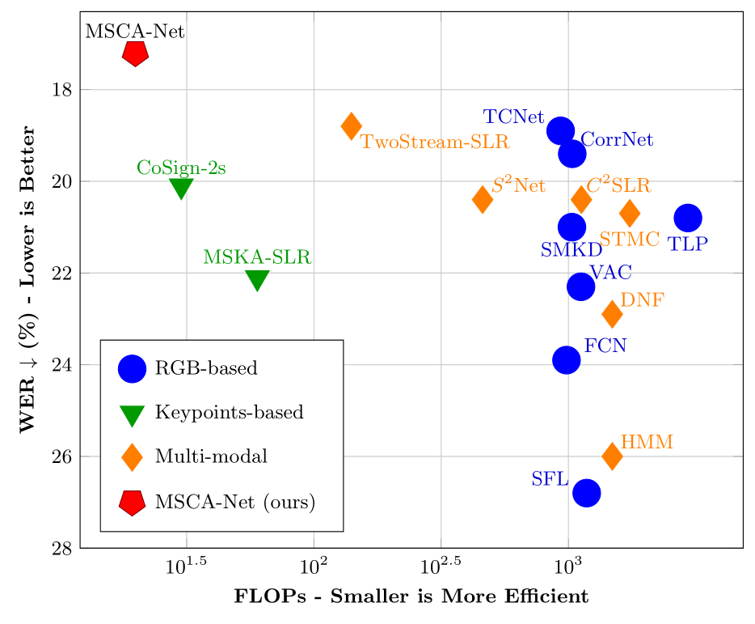
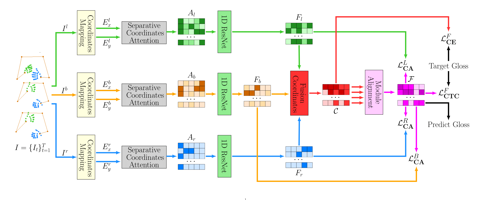
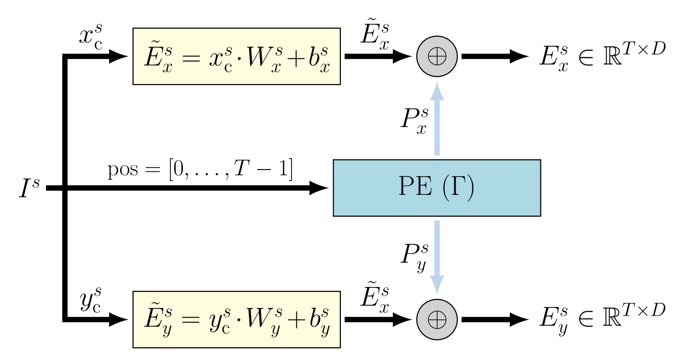
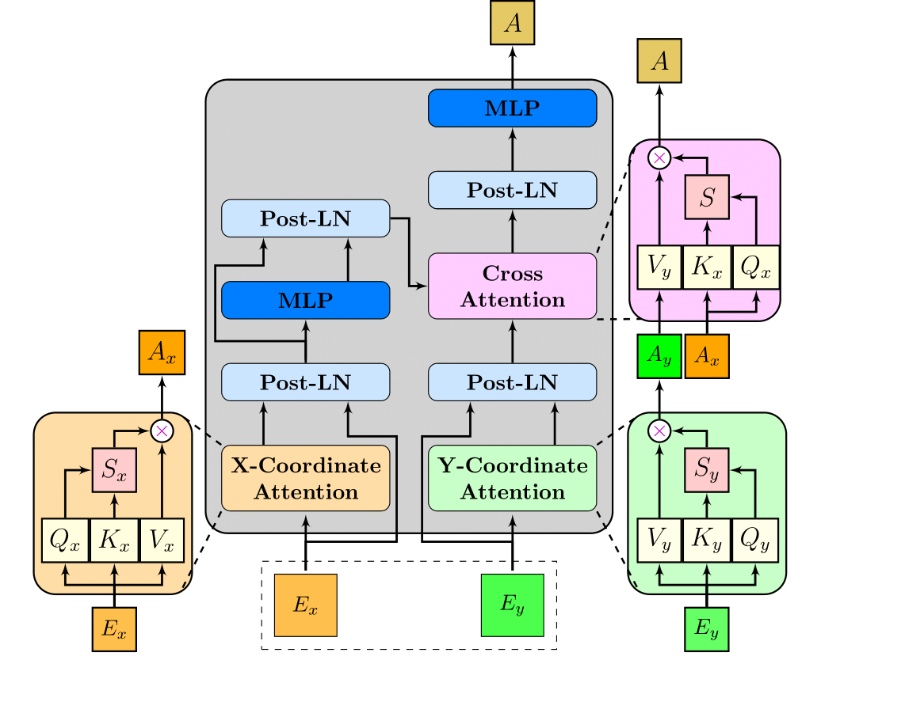
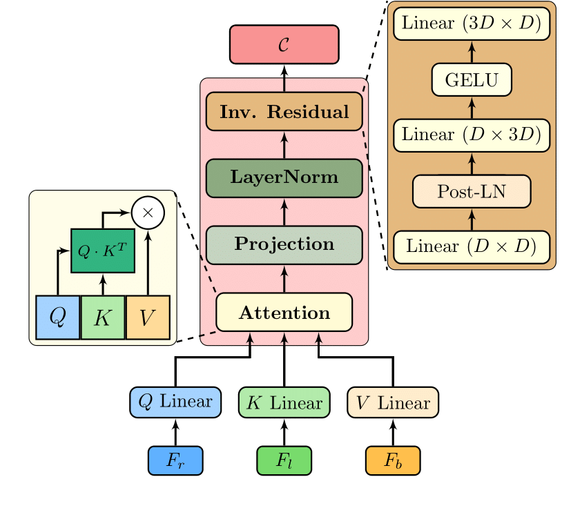

# MSCA-Net: Separative Coordinates Attention for Axis-Specific Modeling in Continuous Sign Language Recognition

<a href="https://pytorch.org/get-started/locally/"></a> [](https://opensource.org/licenses/MIT) [](https://www.python.org/downloads/release/python-380/)

## Abstract

<p align="justify">
Continuous Sign Language Recognition (CSLR) models that rely on skeleton keypoints have shown high efficiency but are limited by a fundamental, underexplored assumption  that remains largely unexplored. Previous works typically represent the x and y coordinates in a unified manner as an inseparable feature vector, which ignores well-established theoretical principles in mathematics and insights from deep learning that emphasize the independent modeling of coordinate axes. As a result, models struggle to capture axis-specific dynamics that are essential for distinguishing phonologically similar signs. In this work, we revisit this assumption by proposing MSCA-Net, a novel multi-stream framework built upon a Separative Coordinates Attention (SCA) module. Our method explicitly disentangles the x and y axes, leveraging the theory of coordinate separability. The SCA module models each coordinate axis over time using parallel pathways. It applies asymmetric attention mechanisms, with self-attention for the x-axis and self-causal-attention for the y-axis, in order to capture their distinct temporal patterns. MSCA-Net achieves new state-of-the-art results on three large-scale CSLR benchmarks, with Word Error Rates of 17.2% on PHOENIX14, 16.8% on PHOENIX14-T, and 25.2% on CSL-Daily. Beyond superior accuracy, our approach is highly efficient, offering a principled and scalable approach for keypoint-based CSLR.

</p>
<p align="center">
  
  <br>
  <em>Performance vs. Efficiency of State-of-the-Art CSLR Models on the PHOENIX-2014 Test Set</em>
</p>

## Architecture of MSCA-Net

<p align="center">
  
  <br>
</p>

<table>
  <tr>
    <td align="center">
        
    </td>
    <td align="center">
      
    </td>
    <td align="center">
      
    </td>
  </tr>
</table>

## Results

MSCA-Net achieves new state-of-the-art results on three large-scale CSLR benchmarks:

| Dataset | WER | Del/Ins | FLOPs | Params | Model | Config |
| :---: | :---: | :---: | :---: | :---: | :---: | :---: |
| PHOENIX-2014 | **17.2%** | 4.6/1.6 | 19.87G | 21M | [ckpt](placeholder) | [config](configs/phoenix-2014.yaml) |
| PHOENIX-2014T | **16.8%** | - | 19.87G | 21M | [ckpt](placeholder) | [config](configs/phoenix-2014t.yaml) |
| CSL-Daily | **25.2%** | - | 19.87G | 21M | [ckpt](placeholder) | [config](configs/csl-daily.yaml) |

## Installation

```bash
conda create -n msca-net python==3.8
conda activate msca-net
# Please install PyTorch according to your CUDA version
pip install -r requirements.txt
```

## Data Preparation

### Datasets

Download datasets from their official websites and place them under the corresponding directories in `data/`:

* [PHOENIX-2014](https://www-i6.informatik.rwth-aachen.de/~koller/RWTH-PHOENIX/)
* [PHOENIX-2014T](https://www-i6.informatik.rwth-aachen.de/~koller/RWTH-PHOENIX-2014-T/)
* [CSL-Daily](http://home.ustc.edu.cn/~zhouh156/dataset/csl-daily/)

### Pretrained Models

Download pretrained models and place them under `pretrained_models/`:
* [PHOENIX-2014](placeholder)
* [PHOENIX-2014T](placeholder) 
* [CSL-Daily](placeholder)

### Keypoints

We provide pre-extracted human keypoints using MediaPipe/OpenPose:
* [PHOENIX-2014](placeholder)
* [PHOENIX-2014T](placeholder)
* [CSL-Daily](placeholder)

Place them under `data/[dataset_name]/`.

## Training

### PHOENIX-2014T
```bash
python main.py --cfg_path configs/phoenix-2014t.yaml \
               --batch-size 8 \
               --epochs 100 \
               --device cuda
```

### PHOENIX-2014
```bash
python main.py --cfg_path configs/phoenix-2014.yaml \
               --batch-size 8 \
               --epochs 100 \
               --device cuda
```

### CSL-Daily
```bash
python main.py --cfg_path configs/csl-daily.yaml \
               --batch-size 8 \
               --epochs 100 \
               --device cuda
```

### Resume Training
```bash
python main.py --cfg_path configs/phoenix-2014t.yaml \
               --resume outputs/Phoenix-2014-T/best_checkpoint.pth
```

## Evaluation

```bash
# Evaluate on PHOENIX-2014T
python main.py --cfg_path configs/phoenix-2014t.yaml \
               --eval \
               --resume outputs/Phoenix-2014-T/best_checkpoint.pth

# Evaluate on PHOENIX-2014
python main.py --cfg_path configs/phoenix-2014.yaml \
               --eval \
               --resume outputs/Phoenix-2014/best_checkpoint.pth
```

## Attention Visualization

Generate attention maps for analysis:

```bash
python main.py --cfg_path configs/phoenix-2014t.yaml \
               --eval \
               --resume outputs/Phoenix-2014-T/best_checkpoint.pth \
               --generate_attention_maps \
               --attention_output_dir ./attention_maps/Phoenix-2014-T
```

<!-- ## Citation

```bibtex
@article{mscanet2024,
  title={MSCA-Net: Separative Coordinates Attention for Axis-Specific Modeling in Continuous Sign Language Recognition},
  author={Your Name},
  journal={arXiv preprint},
  year={2024}
}
``` -->

## License

This project is licensed under the MIT License - see the [LICENSE](LICENSE) file for details.

## Acknowledgments

- PHOENIX-2014 and PHOENIX-2014T dataset providers
- CSL-Daily dataset providers  
- PyTorch team for the deep learning framework
- Sign language research community

---

For more details, please refer to our paper and feel free to contact us for any questions.
